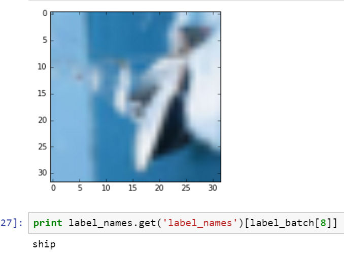
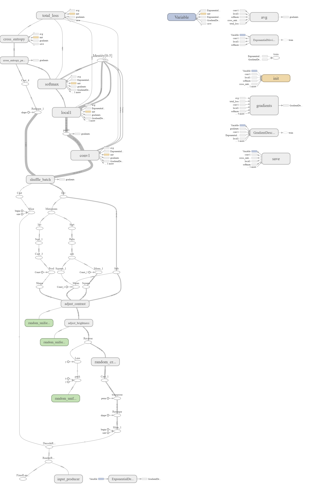
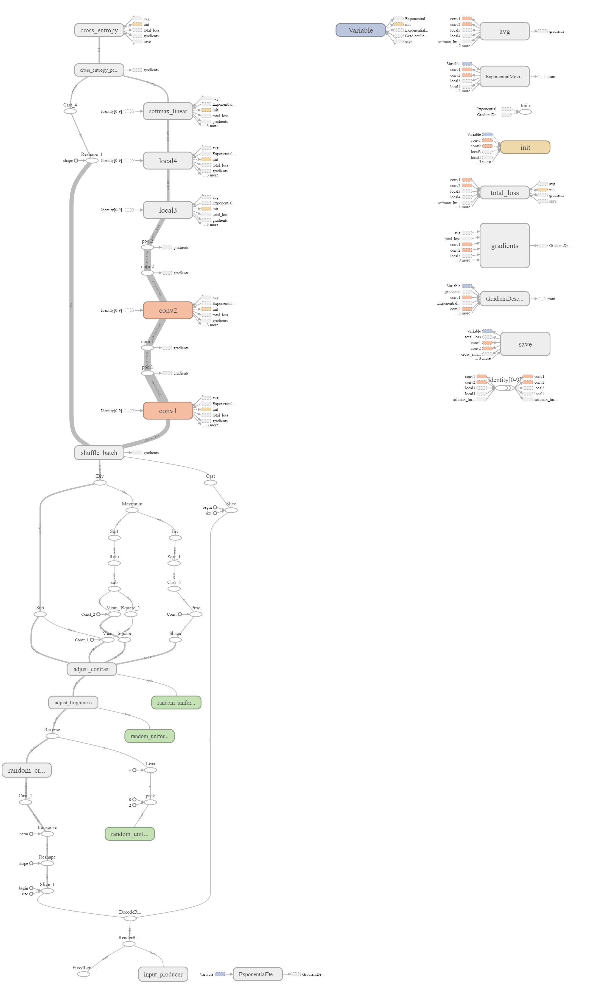
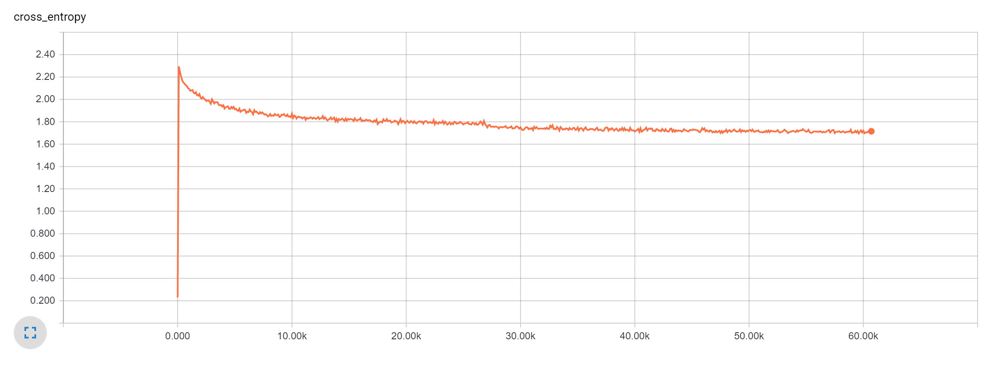
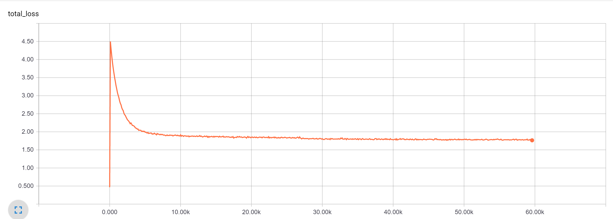

# Convulutional Neural Network

### About the dataset

*****

The CIFAR-10 dataset consists of 60000 32x32 color images in 10 classes, 6000 images per class. The training set is 50000 images and the test set is 10000 images. 

**Classes**: Airplane, Automobile, Bird, Cat, Deer, Dog, Frog, Horse, Ship, Truck

**Features**: One image contains a vector of 3072 values. This corresponds to 3 values for each pixel. There are three values because these are color images.
Labels: The labels are an integer between 0 and 9, representing the category.

The problem is a supervised mulitnomial classification problem. My goal is to minimize the error rate on the test set.

**One Observation**

### Metrics

*****

I will use accuracy on the test set as my final evaluation metric. I will use loss vs steps to determine a reasonable number of steps to trade off between training time and performance.

### Baseline Models

*****

**Baseline model 1**: an accuracy score for guessing a single class for every observation.

**Baseline model 2**: an accuracy score for using a random number generator to label randomly.

Accuracy on test set for all one class: 10% 
Accuracy on test set for random class: 9.69%

### Data Preprocessing

***** 

I started with the preprocessing shown in the Tensorflow Convolutional Neural Network tutorial:
* Images cropped to 24x24 randomly for training and centrally for evaluation
* Images approximately whitenened to make the model insensitive to dyanmic range
* Dataset artificially increased by randomly flipping image from left to right
* Dataset artificially increased by randomly distoring brightness and contrast of images

### About the different layers [I wrote this section for me]

*****

#### Pooling

#### Normalization

#### Dropout

#### Architecture Notes
	- How to connect layers
	- How different parameters impact size, padding, stride, output depth etc.
	- 
### Modeling

*****

#### Simple Model Architecture:
- **Input:**  128x24x24x3 [batch size, width, height, input depth]
- **Convolution Layer:**
	- Number of Filters (K): 12
	- Stride (S): 1
	- Spatial extent (F): 3
	- Amount of Zero padding (P): 1 
	- Out: 124x24x24x12
- **Activation:** Relu
- **Pool1:**
	- Spatial Extent (F): 2
	- Stride (S): 2
	- Depth: 12
	- Out: 128x12x12x12
- **FC:**
	- Full connected Layer
	- Out: 128x10
- **Softmax:** Out 128x10

Cuda ConvNet Architechture:
- **Input:** 128x24x24x3  [ batch size, width, height, depth ]
- **Conv Layer:** Out = 128x24x24x64
	- Filters (K) = 64
	- Spatial Extent (F) = 3
	- Stride (S) = 1
	- Amount of Zero Padding (P) = 1
- **Pool 1:** Out = 128x12x12x64
- **Norm 1:** Out = 128x12x12x64
- **Conv Layer 2:** = Out 128x12x12x64
- **Norm 2:** Out = 128x12x12x64
- **Pool 2:** Out = 128x6x6x64
- **Local 3:** Out = 128x384
- **Local 4:** Out = 128x192
- **Softmax:** Out = 128x10 

### Entropy and Loss Vs Steps

*****

Graphed the entropy and loss vs steps to find a somewhat low number of steps where performance would be different. I decided if I give a model about 10k steps, I should have a reasonable expectation of what the results will look like. 

**Entropy vs Steps for Cuda Net**

**Loss vs Steps for Cuda Net**

### Performance

*****

After checking how many predictions had the correct answer as the top choice, the following were the accuracy scores for the two models:

Simple architecture test accuracy after 10k steps: **.543**

Cuda convnet setup test accuracy after 118k steps: **.8174**

### Conclusion

*****

#### Server Setup
When originally planning this project, I thought I wouldn't have a lot of trouble setting up my AWS server with the GPU support. The big hiccup was some additional steps for the Cuda installation on EC2. After finding a blog explaining the step by step for the Cuda install, the remaining tensorflow installation instructions went smoothly.

#### Setting up the Conv Net
I started with the TensorFlow tutorial for ConvNets and found myself studying the code and trying to reverse engineer the functionality. I reached a point of frustration and realized I would learn more by making a simple architecture without a tutorial.

#### Training
TensorFlow and TensorBoard making training an algorithm very easy. I love the TensorBoard setup which takes a lot of the effort out of visualizing your results. I wish I had been able to try additional architectures and try to tune model architectures more. After the time it took to understand tensorflow, I down scoped my project to focus on getting two working architectures and scores for those architectures.

#### Evaluation
My biggest dissappointment was not getting a training score vs steps graph for the models. When I tried to run the script to get the periodic test scores for the graph, I ran out of memory. I ran out of time to deal with resource sharing on the server. The CudaNet architecture outperformed my simple architecture as expected. 

#### What would I do with this dataset given more time?
I would like to create a presentation that breaks down how convolutional neural networks function. I'd also like to compare different architectures and try to give an opinion on why one is outperforming the other. Typically when I run out of time on a machine learning problem, I want to pursue additional preprocessing of data and additional parameter tuning. I found the architecture aspect of deep learning conv nets really interesting and hope to study them more in the future.

If I were to start this project again today, I would focus on adjusting the architectures to see performance changes and getting better graphs to evaluate performance.

#### What went well, what did not?
It was mostly unforeseen challenges for this project. The server setup was more difficult than anticipated. Getting an understanding of conv nets in tensorflow took me longer than anticipated. There were a lot of learning curves I was on the wrong side of. My favorite part was switching my architecture to a simple conv net - that was the moment I started to understand tensorflow and conv nets better.

